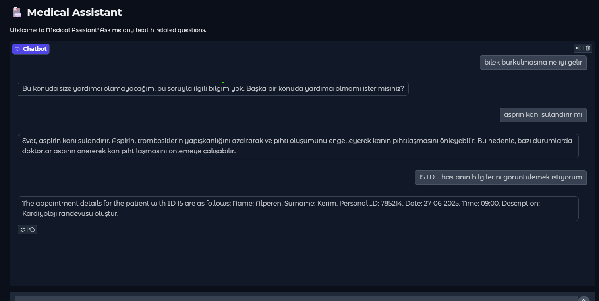

## Healthcare Chatbot

This is a healthcare-focused chatbot designed to answer medical queries and manage appointments. It interacts with an API to handle booking operations and utilizes Retrieval-Augmented Generation (RAG) for processing medical data from Hugging Face. The chatbot UI is built with Gradio and can be accessed online via local hosting.

## Features
- **Appointment Management:** Interacts with a booking API to schedule, update, retrieve, and delete appointments.
- **Medical Query Processing:** Uses FAISS-based embedding search for handling medical-related questions.
- **Chatbot Agent:** Analyzes user queries, calls API endpoints, and handles invalid responses.
- **User Interface:** Built with Gradio for easy interaction, hosted with `share=True` for online accessibility.
- **SQLite Database:** Stores appointment data with full CRUD operations.

## Setup

1. **Clone the repository:**
   ```bash
   git clone https://github.com/sevvalbulburu/healthcare_chatbot.git
   ```
2. **Create a virtual environment and install dependencies:**
   ```bash
   python -m venv venv
   source venv/bin/activate  # On Windows use `venv\Scripts\activate`
   pip install -r requirements.txt
   ```

## Project Structure
```
healthcare_chatbot/
│── backend/
│   │── flask_api.py        # Booking API created with Flask (Deployed on PythonAnywhere)
│   │── api_endpoints.py    # API endpoints used by the chatbot
│   │── chatbot.py          # Main chatbot logic (query analysis, RAG, API calls, etc.)
│   │── crud.py             # CRUD operations for managing appointments in the database
│   │── database.py         # SQLite database setup for appointment management
│   │── load_data.py        # Medical data processing and FAISS embedding
│   │── models.py           # Pydantic models for API and database schema
│
│── ui/
│   │── app.py              # Gradio-based UI for interacting with the chatbot
│
│── tests/
│   │── crud_test.py        # Unit tests for CRUD operations
│
│── requirements.txt        # Project dependencies
│── README.md               # Project documentation
```

## Running the Chatbot

1. **Access the API server:**
   The Flask API is deployed on PythonAnywhere. You can access it at:
   [svvlblbr.pythonanywhere.com](https://svvlblbr.pythonanywhere.com)

2. **Launch the Chatbot UI:**
   ```bash
   python ui/app.py
   ```
   The UI will be accessible via a shareable Gradio link.

## Dataset Files
Original medical dataset can be downloaded from:
[Huggingface Link](hf://datasets/codexist/medical_data/data/train-00000-of-00001.parquet)
Medical dataset files can be downloaded from:
[Google Drive Link](https://drive.google.com/drive/folders/1aQSwLBLIwGH5u9LwLCHGix9Qh6kbPp6v?usp=drive_link)

## Testing
Run unit tests for CRUD operations:
```bash
pytest tests/crud_test.py
```

## API Endpoints
# Healthcare Chatbot API

This API provides endpoints for managing appointments and retrieving patient information. It is designed to be used by the Healthcare Chatbot to facilitate appointment booking, retrieval, and updates.

## Endpoints

### 1. Home
**Endpoint:** `GET /`

Returns a welcome message indicating that the API is running.

### 2. Create an Appointment
**Endpoint:** `POST /appointments/`

**Request Body:**
```json
{
    "name": "John",
    "surname": "Doe",
    "personal_id": "123456789",
    "date": "2025-04-01",
    "time": "10:00",
    "description": "General check-up"
}
```
**Response:**
```json
{
    "message": "Appointment booked successfully"
}
```

### 3. Get All Appointments
**Endpoint:** `GET /appointments/`

**Response:**
```json
{
    "appointments": [
        {
            "id": 1,
            "name": "John",
            "surname": "Doe",
            "personal_id": "123456789",
            "date": "2025-04-01",
            "time": "10:00",
            "description": "General check-up"
        }
    ]
}
```

### 4. Get Appointment by ID
**Endpoint:** `GET /appointments/{appointment_id}`

**Example Request:** `GET /appointments/1`

**Response:**
```json
{
    "id": 1,
    "name": "John",
    "surname": "Doe",
    "personal_id": "123456789",
    "date": "2025-04-01",
    "time": "10:00",
    "description": "General check-up"
}
```

### 5. Get Patient Information
**Endpoint:** `GET /patients/{personal_id}`

**Example Request:** `GET /patients/123456789`

**Response:**
```json
{
    "general_info": {
        "name": "John",
        "surname": "Doe",
        "personal_id": "123456789"
    },
    "appointments": [
        {
            "id": 1,
            "date": "2025-04-01",
            "time": "10:00",
            "description": "General check-up"
        }
    ]
}
```

### 6. Update an Appointment
**Endpoint:** `PUT /appointments/{appointment_id}`

**Example Request:** `PUT /appointments/1`

**Request Body:**
```json
{
    "date": "2025-04-02",
    "time": "11:00"
}
```
**Response:**
```json
{
    "message": "Appointment updated successfully"
}
```

### 7. Delete an Appointment
**Endpoint:** `DELETE /appointments/{appointment_id}`

**Example Request:** `DELETE /appointments/1`

**Response:**
```json
{
    "message": "Appointment deleted successfully"
}
```

## API Call Examples
- This API is designed to work with the Healthcare Chatbot to manage patient appointments efficiently.

Here are examples of how to call the API endpoints using `curl`:

### Create an Appointment
```sh
curl -X POST "http://your-api-url/appointments/" -H "Content-Type: application/json" -d '{
    "name": "John",
    "surname": "Doe",
    "personal_id": "123456789",
    "date": "2025-04-01",
    "time": "10:00",
    "description": "General check-up"
}'
```

### Get All Appointments
```sh
curl -X GET "http://your-api-url/appointments/"
```

### Get Appointment by ID
```sh
curl -X GET "http://your-api-url/appointments/1"
```

### Update an Appointment
```sh
curl -X PUT "http://your-api-url/appointments/1" -H "Content-Type: application/json" -d '{
    "date": "2025-04-02",
    "time": "11:00"
}'
```

### Delete an Appointment
```sh
curl -X DELETE "http://your-api-url/appointments/1"
```

## Notes
- Originally, the booking API was built with FastAPI, but it was later converted to Flask due to PythonAnywhere’s lack of FastAPI support.
- The Flask API is deployed as a web service on PythonAnywhere, requiring an account and proper setup to modify.
- The chatbot is first, designed for local hosting. After, shared in Huggingface Space.

## Contribution
Feel free to contribute by opening a pull request or reporting issues.

## Result Example


## Interface and Application
The interface is a simple web page that allows users to interact with the booking API. It shared in Huggingface-Space platform.
It can be accessed via:
[Application](https://huggingface.co/spaces/sevvalbulburu/health_care_chatbot)

---

For further inquiries, contact [Şevval Bulburu](https://github.com/sevvalbulburu).
